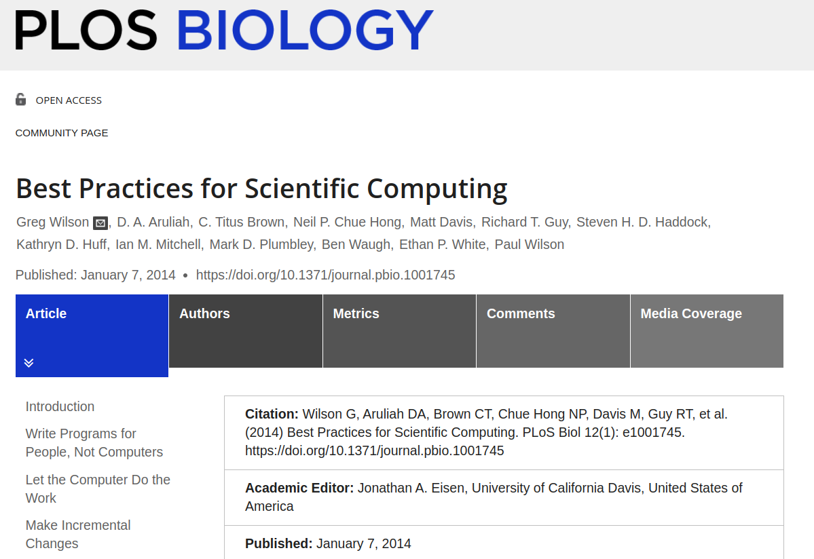
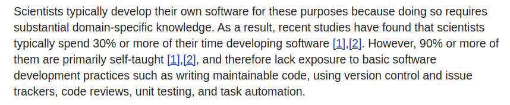
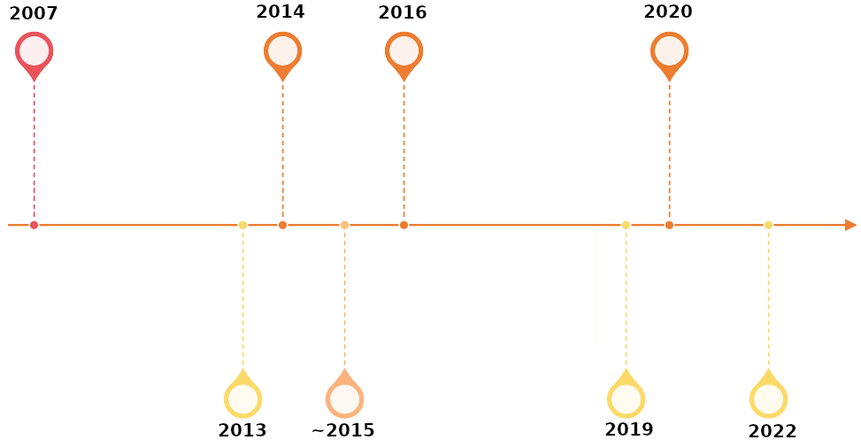

```{r setup, include=FALSE}
knitr::opts_chunk$set(echo = FALSE)
```

<script src="https://ajax.googleapis.com/ajax/libs/jquery/1.12.2/jquery.min.js"></script>

<script>
    $(document).ready(function() {
      $('slide:not(.title-slide, .backdrop, .segue)').append('<footer label=\"BestPracticesSciComp"></footer>');    
    })
</script>

<style>
  footer:after {
    content: attr(label);
    font-size: 12pt;
    position: absolute;
    bottom: 20px;
    left: 100px;
    line-height: 1.9;
  }
</style>

<style type="text/css">
slides > slide:not(.nobackground):after {
  content: '';
}
</style>

<div class="notes">

Bio: 
Currently a PhD Researcher at EPCC, School of Informatics, at the University of Edinburgh, project title: "Coding Smart in Academia: Evidence-Based Software Engineering Approaches for High-Quality Research Software Projects". 
Flic Anderson has been a Research Assistant in Bioinformatics in the Wallace Lab (within the Institute for Cell Biology) at the University of Edinburgh. 
Flic was part of the development team for the 'riboviz' open source software package for processing and analysis of ribosome profiling data, working with colleagues from EPCC (University of Edinburgh) to make the codebase more robust & sustainable.   
With a background in Ecology and Botany (previously a Research Assistant at the Royal Botanic Garden Edinburgh), Flic has worked with a wide range of types of biological data using different software tools and programming languages (particularly R) for the last 8 years, and found herself drawn towards bioinformatics and research software engineering. 
Flic is a member of the Edinburgh Carpentries and a certified Carpentries instructor in foundational coding and data science skills for researchers. 

Title: Best Practices for Scientific Computing 

Abstract:  
Discussion of a key paper in research software engineering which makes recommendations for a set of practices to improve software developed for research, based on authors' experience and teaching, as well as research in the scientific computing and software engineering fields.  
</div>


## HOW TO (RE-)USE THIS MATERIAL

This is a `.html` presentation created in `R Markdown` with `ioslides`. 

(It's been written in a [.Rmd](http://rmarkdown.rstudio.com) file, and I generated .html slides by 'knitting' it in Rstudio.)

You can check out the code used to make these slides at the [Talk repo](https://github.com/FlicAnderson/20230215-JournalClub-BestPractices/) on Github, and adapt it for your own presentations if you like - there's a MIT Licence on the repo, which means: 

*"Basically, you can do whatever you want as long as you include the original copyright and license notice in any copy of the software/source."*

Source: [tl;drLegal](https://tldrlegal.com/license/mit-license)


## Outline 

__Article:__  
- Paper format  
- Background / research context  
- Best Practices   
- Authors' conclusions
 
__Qs & Discussion:__   
- My opinions about the paper 
- Your questions about the paper  
- Discussion - which best practice do you think is most important? 

__RS: Research software__    
__SE: Software engineering__ 


## The Article
```{r, echo=FALSE,out.width="90%", out.height="25%",fig.align='center'}

``` 

## Paper Format  

* presenting 8 broad best practice tips & 24 recommendations     
* no abstract / methods / research Qs / discussion    
* reasonably informal paper, accessible and readable    
* selected this because it's personally impactful and has influenced my career!   


## Background / Research context  

* article published 2014 @ PLOS Biology   
* [Wilson 2006](https://doi.org/10.1109/MCSE.2006.122) paper "Software Carpentry: getting scientists to write better code by making them more productive" - prototype ideas expanded on in the 2014 paper  
* [Heroux & Willenbring 2009](https://doi.org/10.1109/SECSE.2009.5069157) "Barely sufficient software engineering: 10 practices to improve your CSE* software" (minimalist!)  
* [Kelly, Hook & Sanders 2009](https://doi.org/10.1109/MCSE.2009.139) "Five Recommended Practices for Computational Scientists Who Write Software" 
* Carpentries' reports (2004+) gathered data from foundational programming/data skills workshop evaluations   
* discusses scientific computing, but applies widely to any software used for generating research outputs  

<font size="3">*CSE: Computational Science and Engineering</font>  


<div class="notes">

* [Heroux & Willenbring 2009](https://doi.org/10.1109/SECSE.2009.5069157) "Barely sufficient software engineering: 10 practices to improve your CSE* software"  
  0) Manage source (the basics)   
  1) Use issue-tracking software for requirements, features and bugs  
  2) Manage source (beyond the basics)  
  3) Use mail lists to communicate  
  4) Use checklists for repeated processes  
  5) Create barely sufficient, source-centric documentation  
  6) Use configuration management tools  
  7) Write tests first, run them often  
  8) Program tough stuff together  
  9) Use a formal release process  
  10) Perform continual process improvement  
  

* [Kelly, Hook & Sanders 2009](https://doi.org/10.1109/MCSE.2009.139) "Five Recommended Practices for Computational Scientists Who Write Software"   
 - Separate  
 - Organise   
 - Review   
 - Test  
 - Simplify  

* RS field back then  
* key papers before this  
* 'scientific computing' vs 'research software'   

Q: Are YOU a research software engineer / researcher-developer? If you think not, do you write code as part of your research?  

This paper was published in a Biology journal, and mentions 'scientific computing', but it's really widely relevant to all research and research software development.  
</div>


## Paper's Aims   
```{r, echo=FALSE,out.width="85%", out.height="25%",fig.align='center'}

```  

* authors' goals in sharing these best practices:  
  - more productive development of RS  
  - faster results for research  
  - code is more reliable, inspires confidence in results  
  - easier (/actually possible) to reproduce results - good research practice
* justifies importance of these in terms of reducing errors/retractions; improving research productivity  

<div class="notes"> 
...
</div>


## 
```{r, echo=FALSE,out.width="49%", out.height="20%",fig.cap="'Best Practices for Scientific Computing', [Wilson et al. 2014.](https://doi.org/10.1371/journal.pbio.1001745)",fig.show='hold',fig.align='center'}
knitr::include_graphics(c("images/best-practices-1-to-4.png", "images/best-practices-5-to-8.png"))
```  

## 1. Write programs for people, not computers 
* your code needs to _run_ and be _correct_, but also must be **understandable**  
* _beware memory limits_ in users, not just computers: reduce cognitive load!  
* **break up programs** into _task-oriented functions_ or chunks  
* helpful, **descriptive names** -> self documenting & less confusing  
* **consistent_styling_of_code** -> faster reading, fewer errors  

<div class="notes"> 

These days, people are more memory limited than computers: reduce cognitive load!  

Consistency means errors are easier to spot, humans are great at pattern recognition

This slideshow is written in R Markdown, not Latex, as it's easier for a human (e.g. me) to read the text in a markdown doc than a latex one. Also, fewer slashes required :D
</div>


## 2. Let the computer do the work
* repetitive tasks? _Don't try to be a computer_  
* don't fear the **CLI**     
* commonly repeated commands & tasks -> **scripts**     
* combining scripts? Consider a **Workflow Management System\*** or automated **build tool** like [Make](https://www.gnu.org/software/make/#:~:text=GNU%20Make%20is%20a%20tool,compute%20it%20from%20other%20files.)   
* **store provenance info** (common file formats plz):  
  - raw data IDs, version numbers  
  - _parameter_ values generating specific outputs  
  - _library/program versions_  
* **cite your software!**  

<font size="3">CLI: command line interface; *: WfMS examples: [nextflow](https://www.nextflow.io/), [snakemake](https://snakemake.readthedocs.io/en/stable/)</font>  

<div class="notes"> 
non-computing background folks miss out on 'command history' and repeatability by avoiding CLI :c   

be reproducible - good for research, good for you!  
</div>


## 3. Make incremental changes
* **no 'requirements' available** upfront for RS     
* RS uses an _iterate-improve_ process; similar to Agile development process  
* **keep iterations SHORT** (~1 week), get feedback, improve  
* use a **version control system** e.g. [Git](https://git-scm.com/):   
  - tracks changes & reverts problems (code & data)   
  - solves collaborating issues - locked files, multiple copies, overwrites, etc.  
  - stores metadata and provenance  
* **version control everything you create manually, regenerate the rest** (archive binaries, but store metadata about them with version control!)

<div class="notes"> 

RS isn't similar to 'traditional SE', IS sim to Open Source Software projects & startups re: no requirements from a 'customer'/user often.    
Therefore RS can't apply a lot of requirements-oriented design and development processes.  

Avoid long development without feedback and course checks.  

</div>  


## 4. Don't repeat yourself (or others)
* having **copies of data / 'code clones' is bad**: likely to cause inconsistency, errors, maintenance headaches...  
* _'single authoritative representation in the system'_ means **only one version of a file / variable / ID** that can be updated in ONE PLACE ONLY  
* write IKEA code: **modularity** -> fixable, reusable and easy to keep small 'chunks' in your head (_mental model_ of code) 
* _stand on the shoulders of giants_: **use others' libraries and packages** instead of doing it yourself. 

<div class="notes"> 
...
</div>  


## 5. Plan for mistakes  
* _defensive programming_: **use assertions** in your code: statements which _check inputs/outputs_, document & _explain your code_, and assist in (inevitable) _debugging_   
* run _automated testing_ with **testing libraries**: unit, integration & regression tests!  
* **turn bugs into tests** (prevents silent reappearance of 'fixed' issues) for RS 
* keeping tests in mind -> _more modular and orthogonal* code_  
* **use debuggers**: they help understand and investigate program behaviour (stop/pause, inspect variables, step between levels of function calls)   

<font size="3">*Orthogonality: independence of one variable/concept from another (e.g. editing _function a_ ideally shouldn't require also fixing _function b_) </font>  

<div class="notes"> 
"to err is human", so why are we always surprised when things go wrong? :D   

* run & report _automated testing_ with **testing libraries**:  
  - unit tests for single units of code correctness  
  - integration tests for combining parts of code  
  - regression tests to check whether behaviour stays the same as parts are edited  

* RS might not allow Test-Driven Development because requirements may not exist upfront, so might need different approaches. 


* debuggers: they help understand and investigate program behaviour

</div>  


## 6. Optimise software only after it works correctly
* don't fix imaginary/hypothetical performance bottlenecks - write, then profile THEN fix   
* write high-level code:  
  - it's more time efficient for development per line of code per unit of time   
  - higher-level code is more understandable for others / more self-documenting    
  - prototype in high-level languages for proof of concept/design testing, THEN implement optimised versions in lower level languages like C  
  - test low-level reimplementations against your high-level prototype to test outputs & functionality  
  

<div class="notes"> 
...
</div>  


## 7. Document design and purpose, not mechanics
* RS can be complex - documentation can help share knowledge, reusability, and lower maintenance time/effort     
* what if the code author leaves? (bus factor*!)   
* avoid restating what code does. Instead: why does it do it THIS WAY. Explain design decisions  
* better to **refactor**** than try to explain really complex chunks of code if possible...  
* documentation generators: build docs into the code - avoids code 'outgrowing' docs/docs becoming stale. (Try [Sphinx](https://docs.readthedocs.io/en/stable/intro/getting-started-with-sphinx.html)) 
* "literate programming" - build the code into the docs! (e.g. [Jupyter Notebooks](https://jupyter.org/) for Python+)


<font size="3">*Bus Factor: "how many people on the project have to get hit by a bus before nobody understands the code?" </font>  
<font size="3">**Refactoring: re-writing code to improve understandability without changing its overall behaviour and outputs</font>  

<div class="notes"> 

Refactoring: re-writing code to improve understandability, consistency and general design without changing its overall behaviour and outputs.

Jupyter Notebooks: originally dev'd for Julia, Python & R, but also Haskell, Ruby and probably more. 

</div>  


## 8. Collaborate
* "code review: get other people to read your code to find bugs fast & cheap!" - says decades of research  
* code review spreads knowledge around the project team  
* if you don't need to review before merging code, you probably won't review at all - require it!     
* pair programming: 'driver' + 'navigator' => great for complex coding tasks or onboarding new folks to project  
* use issue tracking (eg. Github) to help team track milestones, task progress, and who is doing what  
* keep in mind that your future self is a collaborator - be nice!  

<div class="notes"> 

* code review spreads knowledge around the project team   

* your future self is a collaborator, as are potential reviewers, supervisors, your future PhD students, peers who'll use your software, your spin-out company, the Nobel Committee etc.  

</div>  


## Authors' Conclusions  
* authors collated their experiences and existing research in way that supports their aims  
* useful practices for solo coders or multi-dev research software teams  
* authors advise NOT doing all of these at once if you aren't already - add practices gradually  
* due to overlap between practices, not too insurmountable to adopt  
* references a [2012 Software Carpentry report](https://software-carpentry.org/files/bib/aranda-assessment-2012-07.pdf) saying the time cost to implement these is offset "almost immediately" by productivity gains  
* authors end stating that "... to achieve the level of rigor that is expected throughout other parts of science, it is necessary for scientists to begin to adopt the tools and approaches that are known to improve both the quality of software and the efficiency with which it is produced." 
* they back this up by saying that universities and funders need to support this 

<div class="notes"> 
...
</div>  


## This Paper Might Change Your Career...

```{r, echo=FALSE,out.width="95%", out.height="17%",fig.align='center'}

```  

<div class="notes"> 

* 2007: first year programming exam: 2%. Told "no use flogging a dead horse"... 
* 2013: Research Assistant job at Royal Botanic Garden Edinburgh, biodiversity data work with spreadsheets & MS Access!  
* 2013: first steps in R... 
* 2014: Software Carpentry workshop   
* ~2015: came across this paper, inspired by pragmatic tips on what I could/should be doing  
* 2016: Data Carpentry workshop  
* 2019: Research Assistant in Bioinformatics at UoEdinburgh on a development team for open source research software project 'riboviz'
* 2020 trained as a Carpentries Instructor to help spread the Best Practices further  
* 2022: started PhD looking at practices in Research Software Engineering at EPCC with Neil Chue Hong (co-author on this paper!)  

* came across this paper around 2015 and was inspired by the summary of what I could/should be doing with my research code  
* started moving towards Letting the Computer Do the Work by writing scripts for data manipulation, working with biodiversity data in Research Assistant role, stopped worrying and learned to love the terminal  
* even though I was working solo, I started Writing Programs for People, Not Computers. That person was me, but still...
* by adopting many of these best practices and Making Incremental Changes, I got bioinformatics role on a development team (UoEdinburgh), met EPCC staff   
* started Planning for Mistakes (dipping my toes into testing/debugging), did a lot of Collaboration (developing with 2x US labs and undergrad/masters students) & Documenting Design & Purpose (also helpful for onboarding students and expanding the dev team!).     
* ... (still haven't quite gotten around to Optimising Software Only After It Works Correctly... (though I never write lower-level code ;D))  

</div>


# Discussion  

## My Opinions 
* in terms of getting scientists writing better code, I'm good proof that this paper helps!  
* I've found it useful for thinking about how to communicate SE concepts to non-computational folks  
* cites some SE research, but non-SE research is from computational biology/ecology mostly - this was what was available at the time, but I wonder if releasing original paper in PLOS Biology limited reach into other fields?  
* the order of practices is fairly reasonable (starting easy, low-hanging fruit) and get more technical towards the end, but this might put off people at extreme ends of novice/expert spectrum?     
* optimisation/profiling might not be applicable for a lot of researchers, and HPC users might balk at being told to use higher-level languages more  
* subsequent paper: Wilson et al. 2017: [Good Enough Practices in Scientific Computing](https://doi.org/10.1371/journal.pcbi.1005510) in PLOS Computational Biology - perhaps less successful than the authors were hoping at sparking shift to these best practices.  
* 2017 paper focuses more on data and research project management practices, reduce SE techniques e.g 'symbolic debugger', 'pair programming'. Collaboration shifted forward to #3 after Software at #2.  
* now there are research software departments in most large universities, and recognition of the 'research software engineer' role - certainly more awareness of the concepts, but is there more uptake? 

<div class="notes"> 

In the 2017 paper they focus more on data and research project management practices, reduce the SE techniques chat e.g 'symbolic debugger', 'pair programming'. Collaboration gets shifted forward to #2 though. 

Wilson et al. 2017: Good Enough Practices in Scientific Computing: 
Summary of practices: 

1) Data management
  - Save the raw data.
  - Ensure that raw data are backed up in more than one location. 
  - Create the data you wish to see in the world. 
  - Create analysis-friendly data.
  - Record all the steps used to process data.
  - Anticipate the need to use multiple tables, and use a unique identifier for every record.
  - Submit data to a reputable DOI-issuing repository so that others can access and cite it.
  
2) Software
 - Place a brief explanatory comment at the start of every program. 
 - Decompose programs into functions. 
 - Be ruthless about eliminating duplication.
 - Always search for well-maintained software libraries that do what you need. 
 - Test libraries before relying on them. 
 - Give functions and variables meaningful names.
 - Make dependencies and requirements explicit. 
 - Do not comment and uncomment sections of code to control a program's behavior.
 - Provide a simple example or test data set. 
 - Submit code to a reputable DOI-issuing repository.
 
3) Collaboration 
 - Create an overview of your project. 
 - Create a shared "to-do" list for the project. 
 - Decide on communication strategies. 
 - Make the license explicit. 
 - Make the project citable. 

4) Project organization 
 - Put each project in its own directory, which is named after the project. 
 - Put text documents associated with the project in the doc directory. 
 - Put raw data and metadata in a data directory and files generated during cleanup and analysis in a results directory. 
 - Put project source code in the src directory.
 - Put external scripts or compiled programs in the bin directory. 
 - Name all files to reflect their content or function. 

5) Keeping track of changes
 - Back up (almost) everything created by a human being as soon as it is created. 
 - Keep changes small. 
 - Share changes frequently. 
 - Create, maintain, and use a checklist for saving and sharing changes to the project.
 - Store each project in a folder that is mirrored off the researcher's working machine. 
 - Add a file called CHANGELOG.txt to the project's docs subfolder. 
 - Copy the entire project whenever a significant change has been made. 
 - Use a version control system.
 
6) Manuscripts 
 - Write manuscripts using online tools with rich formatting, change tracking, and reference management. 
 - Write the manuscript in a plain text format that permits version control.

</div>


## Questions? 

* Opinions of the paper's 'best practices'? - anything missing?  
* Which practice do you think is most important? Why?  


## Most important to you?
```{r, echo=FALSE,out.width="44%", out.height="20%",fig.cap="'Best Practices for Scientific Computing', [Wilson et al. 2014.](https://doi.org/10.1371/journal.pbio.1001745)",fig.show='hold',fig.align='center'}
knitr::include_graphics(c("images/best-practices-1-to-4.png", "images/best-practices-5-to-8.png"))
```  


